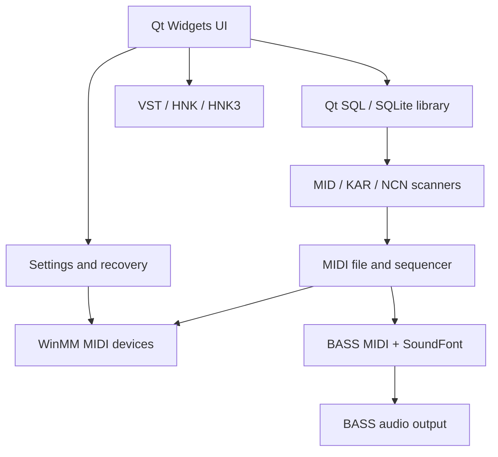

# Build-Recovery Change Log and Technical Record

> Branch: `feat/build-recovery`  
> Baseline: inherited public `3.0.0-alpha` snapshot (commit `dd0eaa1`)  
> Scope date: 2026-09-16 to 2026-09-17  
> Verified development environment: Windows 11 x64, Visual Studio 2022,
> MSVC 14.44 x64, Qt 5.15.2 `msvc2019_64`, CMake + Ninja.

This is the consolidated technical record for the recovery work.  Detailed
instructions remain in the phase documents linked below; this file answers
what changed, why, how the current system is arranged, and what has actually
been tested.

## Recovery decisions

| Decision | Reason and effect |
| --- | --- |
| Recover Windows x64 first | It is the environment used for the active recovery build. Linux and installer work remain separate. |
| Keep Qt Widgets and C++11 | Restores a working baseline with the least product risk. Qt 6 is a later migration, not an implied compatibility claim. |
| Use CMake + Ninja while retaining qmake | CMake makes VS 2022 configuration, dependency discovery, staging, and future CI reproducible; qmake remains the historical reference. |
| Disable legacy HNK by default | The public snapshot lacks the HNK reader sources. The recovery build supports the present MID/KAR/NCN paths and never claims HNK compatibility. |
| Design HNK3 separately | HNK3 is a future clean-room, signed package format; it must not be treated as a drop-in implementation of the unavailable legacy reader. |
| Test from a staged folder | A build directory may accidentally resolve DLLs or content from the checkout. The staged layout more closely represents what a user runs. |
| Treat VST as optional/untrusted native code | VST loading runs third-party code in-process. Safe Mode and Reset Settings must work before VST scanning is enabled. |

## What changed

### 1. Build and dependency recovery

- Added a Windows-oriented `CMakeLists.txt` recovery build and
  `cmake/HandyDependencies.cmake`.
- Selected C++11, Qt Core/Gui/Widgets/SQL and Qt 5 WinExtras for the verified
  configuration.  The CMake variable `HK_QT_MAJOR_VERSION` reserves a
  controlled Qt 6 migration path, but Qt 5.15 is the currently verified kit.
- Added explicit x64 BASS, BASSMIDI, BASS FX, BASSMIX, BASS VST and WinSparkle
  linkage and runtime-file checks.
- Added automatic `windeployqt` deployment after a Windows build, including
  `languages/en.qm`, `Style.ini`, the BASS family, WinSparkle, and the
  recovery launchers.
- Added the bundled RtMidi include path and fixed source issues exposed by the
  modern MSVC build, including the missing `QPainterPath` include and
  conversion of ANSI WinMM device names to `QString` with the correct
  encoding.
- Fixed a debug-only uninitialised VST metadata variable that triggered
  MSVC Runtime Check Failure #3.  Startup now proceeds without that dialog.
- Included the English translation asset in deployment; Thai/English switching
  was manually verified.

### 2. HNK boundary and HNK3 architecture record

- Added `HK_ENABLE_HNK`, defaulting to `OFF`, to CMake and aligned code
  paths for scanning, playback, medley loading, and settings so the normal
  build never references absent HNK files.
- An explicit `HK_ENABLE_HNK=ON` configuration fails early with a useful
  message until all authorised legacy reader files exist.
- Recorded the legacy-HNK decision in
  [HNK option](HNK-OPTION.md).
- Added [HNK3 RFC](HNK3-RFC.md): a separate signed, single-song package design
  for attribution and tamper detection.  No HNK3 reader, writer, encryption,
  or playback support has been added to the application yet.

### 3. Runtime staging and release-quality tooling

A release-like runtime is produced below the build directory:

```text
build\\msvc-x64-release\\stage\\HandyKaraoke
  HandyKaraoke.exe + Qt/BASS/WinSparkle DLLs
  platforms\\  sqldrivers\\  languages\\en.qm
  Songs\\KAR
  Songs\\NCN\\Song, Lyrics, Cursor
  Songs\\HNK
  SoundFonts\\  VST\\
```

The stage deliberately excludes user songs, SoundFonts, VST plug-ins, and
configuration.

| Target / script | Purpose |
| --- | --- |
| `stage-runtime` | Build then assemble the clean runtime layout. |
| `stage` | Short alias for `stage-runtime`. |
| `stage-smoke` | Run `scripts/Test-StageRuntime.ps1` against the stage manifest. |
| `stage-fixture` | Generate legal synthetic KAR `FF 05` and `Words`/`FF 01` regression files in staged `Songs\\KAR`. |
| `Test-StageRuntime.ps1` | Verify executable, runtime DLLs, Qt platform/SQLite plug-ins, recovery launchers, language file, and expected empty content folders. |
| `New-KarWordsFixture.ps1` | Emit `KAR-Words-FF01-Regression.kar` and `KAR-Lyrics-FF05-Regression.kar`; both are generated, never committed as media. |

This arrangement addresses the earlier launch failures caused by missing
`Qt5Sqld.dll`, `Qt5Widgetsd.dll`, `bass.dll`, and `bassmidi.dll`.
If staging cannot overwrite `HandyKaraoke.exe`, the program is still open;
Windows prevents the relink/copy until it has been closed.

### 4. Settings and MIDI-device recovery

The original settings stored numeric WinMM device indexes.  Windows can reorder
those indexes or a stored device can disappear, which made old settings capable
of breaking startup.

The recovery code now:

1. still reads legacy numeric values for compatibility;
2. saves MIDI output, MIDI input, and channel mappings by device name after a
   successful start;
3. resolves the stored names on later starts;
4. bounds-checks every numeric index and per-channel mapping; and
5. falls back safely when a device is absent:

   - output: **Midi Synthesizer (SoundFont)**
   - input: **None**
   - invalid channel mapping: **Midi Synthesizer (SoundFont)**

Two recovery entry points are deployed beside the executable:

- `HandyKaraoke.exe --safe-mode` / `HandyKaraoke-SafeMode.cmd`:
  uses temporary default settings and skips VST loading.
- `HandyKaraoke.exe --reset-settings` /
  `HandyKaraoke-ResetSettings.cmd`: moves the two configuration files into a
  timestamped backup folder but preserves the song database and media.

The no-hardware/stale-settings and Safe Mode/Reset Settings flows were manually
tested on the Windows recovery environment.  A physical-MIDI reconnect and
port-reordering test is deliberately deferred until hardware is available.

### 5. MIDI/KAR parser and playback hardening

#### KAR text-track compatibility

Some KAR files put karaoke text in a track named `Words` or `Lyrics` using
MIDI **Text Event** `FF 01`; older HandyKaraoke logic only consumed MIDI
**Lyric Event** `FF 05`.  The parser now:

- preserves text events separately;
- recognises a sequence/track name of `Words` or `Lyrics`;
- uses `FF 01` events from those tracks as the lyric fallback when `FF 05`
  lyrics are absent;
- ignores Soft Karaoke header records beginning with `@`; and
- preserves the `\\` and `/` line markers as lyric line advances.

This was validated first with the supplied real KAR privately, then with the
redistributable synthetic fixture.  Commercial songs are not included in the
repository.

#### MIDI event safety

- Meta, SysEx, and invalid events are now rejected before MIDI channel dispatch.
  Those event classes have no normal channel; allowing them into the
  channel-mixer array could access it out of bounds and crash during KAR
  playback.
- Missing MIDI time signatures now default to **4/4** for bar calculations.
  The fixture also writes an explicit `FF 58` 4/4 event.
- The legacy sequencer advances its clock from ordinary channel events rather
  than lyric meta-events.  The fixture therefore contains short note-on/off
  pairs around every lyric boundary, rather than changing production timing
  semantics.
- The fixture writes the valid one-data-byte Program Change
  `C0 00` (Acoustic Grand Piano) before its notes.  This replaced an invalid
  attempt to represent Program Change as a three-byte event.

- The three speaker-label/icon helper functions now return an empty `QString`
  for an invalid `SpeakerType`, removing the MSVC C4715 missing-return warnings
  without attempting to use an invalid asset path.

- P3.1 removed the remaining MSVC warnings: invalid speaker/Chorus enum values
  now have safe fallbacks, and raw MIDI controller bytes use explicit `BYTE`
  conversions. GitHub Actions run 28 compiled without any compiler warnings.

### 6. P4a BASS stack refresh — local validation

- Added `scripts/Refresh-BassSdk.ps1`, which downloads the selected official
  BASS packages, validates their headers and x64 artifacts across the package
  layouts, and supports a separate `-Apply` operation with a timestamped
  local backup.
- On 2026-09-17, the Windows x64 maintainer applied BASS 2.4.18.3, BASSMIDI
  2.4.16, BASSmix 2.4.13, and BASS FX 2.4.12.6. BASS/BASSMIDI/BASSmix changed
  header, x64 import library, and DLL; BASS FX changed the DLL while its header
  and import library were byte-identical. BASS_VST remains 2.4.1.
- The Release configure, staged runtime manifest, synthetic KAR fixture
  generation, and manual NCN/MIDI + SoundFont, KAR FF01/FF05, tempo, and
  transpose checks all passed after the refresh.
- The refreshed binary commit `ee71674` passed GitHub Actions Windows x64
  recovery build run 51 on 2026-09-17, including staged validation, fixture
  generation, and artifact upload.

### 7. P3 installer packaging — local validation

- Replaced the release build route with a staged-runtime Inno Setup script and
  a PowerShell driver that first runs `stage-smoke`.
- The new script takes explicit stage/output paths and never uses the former
  workstation-specific paths. It supports machine-wide and per-user Inno Setup
  6/7 installs, including the winget per-user Inno Setup 7 location.
- On 2026-09-18, the Windows x64 maintainer produced an unsigned installer,
  installed it, and confirmed it behaves like the tested staged runtime.
- The maintainer verified install, launch, user-data creation, uninstall, data/media retention, reinstall, and relaunch locally on 2026-09-18. A separate clean-machine/VM repetition remains pending.

## Current architecture



The solid, verified recovery path is **Qt Widgets → MID/KAR/NCN → sequencer →
SoundFont/BASS**.  HNK is disabled; VST is not part of the release gate; HNK3
is documentation only.

## Verification record

| Area | Result | Evidence / limit |
| --- | --- | --- |
| VS 2022 + Qt 5.15.2 x64 build | PASS | Release and Debug builds completed after recovery fixes. |
| Runtime DLL deployment and manifest | PASS | `stage-smoke` verified the staged Qt/BASS runtime layout; application launched from the stage. |
| Hosted Windows CI | PASS | GitHub Actions run 16 completed Qt installation, CMake/Ninja Release build, `stage-smoke`, fixture generation, and stage-artifact upload (2026-09-17). |
| Language switch | PASS | Thai and English switched successfully. |
| NCN/MIDI + SoundFont | PASS | Manually tested by maintainer; MIDI and SoundFont playback were good. |
| No MIDI hardware / stale settings | PASS | SoundFont/None fallback and recovery paths tested. |
| Safe Mode and Reset Settings | PASS | Both recovery flows worked as expected. |
| Real KAR `Words` / `FF 01` | PASS | Lyrics advanced after the parser fix. The supplied commercial file is not a repository fixture. |
| Synthetic KAR `Words` / `FF 01` | PASS | Text advanced, short piano notes were heard, and the application neither hung nor exited. |
| KAR `FF 05` fixture | PASS | Synthetic staged fixture showed advancing lyrics and piano notes; no hang or exit (maintainer test, 2026-09-17). |
| SQLite creation/reopen from a clean staged folder | PASS | Isolated `stage\\HandyKaraoke\\Data\\Database.db3` created (28,672 bytes), had the `SQLite format 3` header and `songs`/`miscellaneous` tables, then reopened without error (maintainer test, 2026-09-17). |
| Staged KAR scan → SQLite | PASS | Scanning the two generated KAR fixtures stored exactly two `KAR` rows (`KAR-Lyrics-FF05-Regression`, `KAR-Words-FF01-Regression`); database remained usable after restart (maintainer test, 2026-09-17). |
| VST scan/playback | NOT TESTED | Legacy checker is intentionally not staged. |
| Physical MIDI reconnect/reorder | DEFERRED | Awaiting test hardware. |

The last confirmed synthetic-KAR result is at branch commit
`0501fbb540e93b4452c9a209d8b35f790b99bdc0` or later.

## Known limitations and technical debt

- Qt 5.15 is a recovery baseline.  Qt 6 requires a separate compatibility and
  packaging pass, especially around removed Qt APIs and deployment.
- BASS and VST components are legacy binaries/interfaces.  Update them only
  after licence review, an adapter boundary, and regression coverage.
- VST2/VSTi loading remains in-process.  A future modern plug-in host should
  favour explicit trust, crash isolation, and VST3 support rather than enabling
  broad legacy scanning.
- Inno Setup contains workstation-specific paths; a portable installer and
  GitHub Actions artifacts are P3 work.
- Auto-update remains disabled pending signing-key ownership and update endpoint
  control.
- No rights are implied to distribute song files, SoundFonts, or VST plug-ins.

## How to continue safely

1. Start every release-oriented test from the staged executable, not the build
   directory.
2. Run `stage-smoke` after CMake/runtime changes and `stage-fixture` before
   the synthetic KAR test.
3. Record the Windows/Qt kit, fixture provenance, audio output, and result in
   the P1c execution log.
4. Keep parser/audio regressions covered by synthetic or otherwise authorised
   fixtures only.
5. Use the P3 CI artifact as the repeatable build baseline; continue installer
   work only after its first hosted run is reviewed.

## Related documents

- [Development status](DEVELOPMENT-STATUS.md)
- [Phase 0 build recovery](PHASE-0-BUILD-RECOVERY.md)
- [Third-party inventory](THIRD-PARTY-INVENTORY.md)
- [P1b runtime staging](P1B-RUNTIME-STAGING.md)
- [P1c release quality gate](P1C-RELEASE-QUALITY-GATE.md)
- [P2 MIDI configuration recovery](P2-MIDI-CONFIG-RECOVERY.md)
- [HNK option](HNK-OPTION.md) and [HNK3 RFC](HNK3-RFC.md)
- [MIDI hardware test plan](MIDI-HARDWARE-TEST-PLAN.md)
- [Work queue](WORK-QUEUE.md)
- [P3 CI and packaging](P3-CI-PACKAGING.md)
