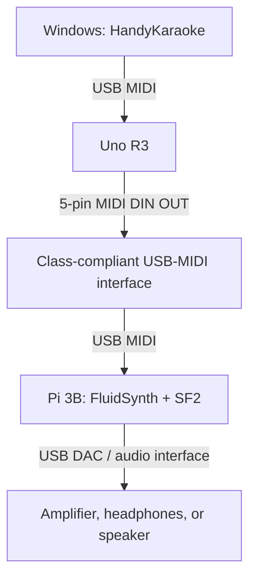

# MIDI Hardware Test and Sound Module Plan

**Status:** design baseline — not yet implemented  
**Scope:** hardware-assisted testing for HandyKaraoke P2 MIDI resilience, plus an
optional Raspberry Pi SoundFont sound module.  
**Repository branch:** `feat/build-recovery`

## Goals

1. Test HandyKaraoke against a **real USB MIDI endpoint**, rather than only
   unavailable hardware or software loopback ports.
2. Reproduce and validate the P2 recovery cases: missing device, USB hot-plug,
   port reordering, stale settings, and name-based recovery.
3. Create a reusable path to a physical MIDI DIN endpoint and, later, a
   standalone SoundFont synthesizer.
4. Keep the test fixture independent of the HandyKaraoke audio engine: it must
   test MIDI I/O separately from the existing BASSMIDI/SoundFont playback path.

## Hardware available

| Device | Role |
|---|---|
| Windows PC | Runs HandyKaraoke and supplies the USB host used for P2 tests. |
| Arduino Uno R3, genuine | USB MIDI test appliance. It contains an ATmega328P main MCU and an ATmega16U2 USB bridge. |
| Raspberry Pi 3 Model B v1.2 | Optional SoundFont sound module, network-MIDI endpoint, and future log/control node. |

## USB roles and constraints

- The **Uno R3** can become a USB MIDI device by replacing the ATmega16U2
  USB-to-serial firmware with USB MIDI firmware.
- The **Pi 3B is a USB host**, not a USB gadget accessible through its
  micro-USB power connector. Do not connect its power port to the Windows PC as
  a data cable.
- The Uno's single USB-B connection cannot be connected to both the Windows PC
  and Pi at the same time. A Pi sound-module path therefore uses MIDI DIN plus
  a USB-MIDI interface, or network RTP-MIDI.
- The original Uno USB-serial firmware is recoverable through ATmega16U2 DFU
  mode. Keep its restore procedure and firmware path before changing anything.

References:

- [Arduino: set ATmega16U2/8U2 to DFU mode](https://support.arduino.cc/hc/en-us/articles/4410804625682-Set-the-Atmega16U2-8U2-chip-on-UNO-Rev3-or-earlier-and-Mega-boards-to-DFU-mode)
- [Arduino: restore Uno USB-to-serial firmware](https://support.arduino.cc/hc/en-us/articles/4408887452434-Flash-the-USB-to-serial-firmware-for-UNO-Rev3-and-earlier-and-Mega-boards)
- [Raspberry Pi 3 Model B specification](https://www.raspberrypi.com/products/raspberry-pi-3-model-b/)

## Architecture A — P2 USB MIDI test appliance

This is the first milestone. It needs only the Uno and its normal USB-B cable.

### Test-device responsibilities

- Present stable USB manufacturer, product, and serial descriptors.
- Receive MIDI emitted by HandyKaraoke and record/indicate Note, Note Off,
  Control Change, Program Change, Pitch Bend, and optionally SysEx.
- Generate known MIDI input messages for HandyKaraoke:
  - a fixed test sequence;
  - optional push-button Note/Program Change;
  - optional potentiometer Control Change.
- Give an unambiguous local indication of received output, initially using the
  Uno's built-in D13 LED. A richer serial log is a later enhancement.

### Firmware sequencing

1. Install Arduino IDE/Arduino AVR Boards and identify the official restore
   image: `Arduino-usbserial-atmega16u2-Uno-Rev3.hex`.
2. Record the DFU entry method: briefly short the **innermost RESET and GND
   pins** of the six-pin header near the USB connector.
3. Upload the ATmega328P test sketch **before** changing the ATmega16U2
   firmware. After USB MIDI firmware is installed, normal USB serial sketch
   upload is unavailable until the serial firmware is restored or an ISP
   programmer is used.
4. Flash a known USB MIDI firmware to the ATmega16U2 using DFU/FLIP on Windows.
5. Confirm Windows enumerates a MIDI input and MIDI output endpoint, then
   select both from HandyKaraoke Settings.

The test fixture is experimental hardware. It must have a documented restore
path before any ATmega16U2 firmware flash.

## P2 acceptance tests

| ID | Procedure | Expected result |
|---|---|---|
| M1 | Select Uno as MIDI output; play a representative NCN/MIDI song. | Uno receives well-formed MIDI messages. |
| M2 | Use Uno test sequence/button as MIDI input. | HandyKaraoke receives the configured messages/mapping. |
| M3 | Close HandyKaraoke, unplug Uno, then start it. | Application starts; it falls back safely to SoundFont/None. |
| M4 | Reconnect Uno, select it again, then plug it into another USB port or hub. | Name-based setting recovery selects the endpoint when Windows exposes the same name; otherwise startup remains safe. |
| M5 | Persist stale/invalid device selections. | Existing P2 reset/safe-mode recovery remains usable. |
| M6 | Repeat hot-plug/startup loop at least ten times. | No crash, blocked startup, or corrupted settings. |

This completes the remaining hardware-dependent item in
`docs/WORK-QUEUE.md` P2.

## Architecture B — optional Pi 3B SoundFont module

The Pi converts external MIDI into audio. This tests HandyKaraoke MIDI output
against a separate synthesizer; it does **not** replace the application's
existing BASSMIDI/SoundFont test.

### Pi software role

- Raspberry Pi OS Lite.
- ALSA for MIDI/audio device discovery.
- FluidSynth as the real-time SoundFont renderer.
- A known General MIDI SoundFont (`.sf2`), chosen and versioned for testing.
- A service that starts FluidSynth with fixed sample rate, buffer configuration,
  SoundFont path, and log location.
- Optional RTP-MIDI endpoint for network testing.

FluidSynth is appropriate because it is a real-time synthesizer that accepts
MIDI events and renders SoundFont audio to an audio device. See the
[FluidSynth project](https://www.fluidsynth.org/) and
[User Manual](https://www.fluidsynth.org/wiki/UserManual/).

### Audio recommendation

The Pi 3B analogue 3.5 mm jack is acceptable for an initial functional test.
For repeatable audio quality and lower noise, use a class-compliant USB audio
DAC/interface (or an I2S audio HAT). Use a powered USB hub if the Pi powers
both USB-MIDI and USB audio peripherals.

### Minimum additions for Architecture B

| Item | Purpose |
|---|---|
| USB-MIDI interface with genuine MIDI IN and OUT | Converts Pi USB host port to MIDI DIN. Avoid unverified one-cable interfaces for regression testing. |
| Two 5-pin DIN sockets/cables | Connects Uno and the interface. |
| Uno MIDI OUT circuit | Current-loop MIDI output from the Uno UART. |
| USB DAC or audio interface | Reliable Pi audio output. |
| SoundFont file selected for testing | Deterministic instrument rendering. |

A later bidirectional DIN version adds MIDI IN with opto-isolation. Do not
connect Pi GPIO/UART directly to a standard MIDI DIN connector.

## Development phases

| Phase | Deliverable | Hardware required |
|---|---|---|
| H0 | Uno DFU restore procedure and backup inventory | Uno + USB-B cable |
| H1 | USB MIDI Uno test appliance | Uno + Windows PC |
| H2 | Execute and record P2 acceptance tests | Uno + Windows PC |
| H3 | Uno MIDI DIN OUT and Pi FluidSynth module | Uno + Pi + USB-MIDI interface |
| H4 | Add DIN MIDI IN with opto-isolation; external keyboard/module tests | H3 hardware + MIDI device |
| H5 | RTP-MIDI, latency logs, soak tests, multiple endpoints | Pi network + optional hardware |

## Deliberate non-goals for the first implementation

- MIDI 2.0/UMP.
- Hosting Windows VST/VST3 plug-ins on Pi 3B.
- Replacing HandyKaraoke's current BASSMIDI/SoundFont renderer.
- Designing a production audio appliance before P2 has real-device coverage.

## Decision summary

Start with **Architecture A**. It gives the lowest-cost, most relevant proof for
HandyKaraoke P2. Keep Pi 3B for Architecture B once USB MIDI recovery is proven
and physical DIN/audio testing becomes useful.
